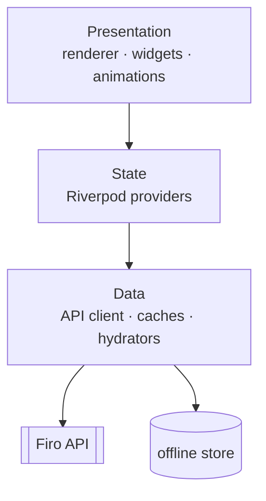

# Firo Client — Renderer Architecture

> **Phase 1 deliverable: architecture only. No app code yet.**
> The backend architecture (the source of truth) lives in the `firo-backend`
> repo under `docs/architecture/`. This document covers the client.

## The client's job (and only its job)

The Firo client is a **thin, deterministic BDUI rendering engine**. It owns
exactly one hard problem: turn a backend-authored, versioned JSON UI tree into a
pixel-perfect, 60/120fps, animated, offline-capable native experience — **and
nothing more.** It never decides *what* to show, *in what order*, *to whom*, or
*why*. It decides only *how* to render, animate, cache, and navigate.

See the boundary in
[ADR-0003](../../../firo-backend/docs/adr/0003-bdui-semantics-vs-presentation-boundary.md).

## Stack

| Concern | Choice | Why |
|---|---|---|
| Framework | **Flutter** (Dart 3, Impeller) | One render pipeline we fully control for a JSON-driven tree; no JS bridge; best animation/media performance; iOS+Android+future web from one codebase |
| State | **Riverpod 2** (codegen) | Compile-safe DI + reactive providers; testable; no `BuildContext` coupling |
| Navigation | **go_router** in backend-driven mode | Routes/nav graph synthesized from a backend `NavigationSpec`; unknown route → safe fallback |
| Models | **freezed**, generated from the backend **OpenAPI 3.1** spec | Contracts can't drift from the server |
| Local store | **Isar/Drift** + secure storage | Offline layouts + entities; tokens in secure storage |
| Media | **cached_network_image** + video/360 players | Progressive, cached, premium |

See [ADR-0008](../../../firo-backend/docs/adr/0008-flutter-client.md).

## Client layering (Clean Architecture)



- **Presentation** — the renderer walks the `Screen` tree and, per node, looks up
  a native `WidgetFactory` in the **component registry**. Animation, gestures,
  transitions, and spacing (from tokens) live here.
- **State** — per-screen/per-section providers; async data states modelled
  explicitly (loading/error/offline).
- **Data** — the typed API client (generated), the layout/entity caches, the
  entity hydrator, and secure auth/session storage.

## What is FORBIDDEN on the client vs. what MUST stay client-side

| Forbidden (business decisions — server owns) | Required (interaction mechanics — client owns) |
|---|---|
| Ranking, personalization, content selection | Gesture recognizers, scroll physics |
| Pricing, eligibility, entitlement | Animation curves, springs, haptics |
| Feature-flag / experiment evaluation | Native page transitions |
| Deciding which screen/section/component appears | Optimistic UI + rollback on failure |
| Any "if user is X show Y" product logic | Secure token storage, offline cache, a11y tree |

The line: **"business decisions" are server-only; "interaction mechanics" are
client-only.** An optimistic save animation is client mechanics; *whether* a save
is allowed is a server decision.

## Client folder layout — `firo-frontend`

```
firo-frontend/
├── lib/
│   ├── bdui/
│   │   ├── model/            # generated Screen/Section/Component/Action/Theme (from OpenAPI)
│   │   ├── renderer/         # tree walker, RenderContext
│   │   ├── registry/         # type -> WidgetFactory, UnknownComponentFallback
│   │   ├── components/       # hero.v1, carousel.v1, card.v1, ... native widgets
│   │   ├── actions/          # ActionDispatcher (navigate/save/track/...)
│   │   ├── theme/            # token resolver, light/dark/future themes
│   │   └── hydration/        # EntityHydrator (contentRef -> entity, offline)
│   ├── core/                 # api client (generated), auth/session, cache, telemetry
│   ├── navigation/           # go_router driven by NavigationSpec + RouteRegistry
│   └── app.dart
├── test/                     # renderer + golden-payload contract tests
└── docs/                     # this documentation set
```

## Release cadence vs. config updates (why BDUI reduces rebuilds)

- **Binary release** (app-store train, phased rollout) is reserved for the
  renderer engine, new component *types*, and native capabilities.
- **Everything else** — layout, order, content, targeting, copy, theme, flags,
  experiments — changes **server-side** through BDUI + the config plane. No app
  release needed. This is the core payoff.

## Degradation & offline UX

- **Unknown component type →** mandatory non-crashing `UnknownComponentFallback`
  (safe placeholder or "Update Firo to see this").
- **Unknown props →** ignored.
- **Offline / stale config →** paint the last-good cached layout (stale-while-
  revalidate), hydrate entities from the local cache, hide tombstoned entities.
- **Backend section timeout →** the server drops that section; the client renders
  the rest. Partial degradation over total failure.

## Phase 1 scope
The renderer contract + component registry + fallback rules, the token/theme
resolver, backend-driven navigation, the offline layout/entity cache, and the
auth/session client — plus golden-payload contract tests against
`home.feed` and `onboarding.taste`. Component *breadth* and advanced media (360/
AR) come later.
